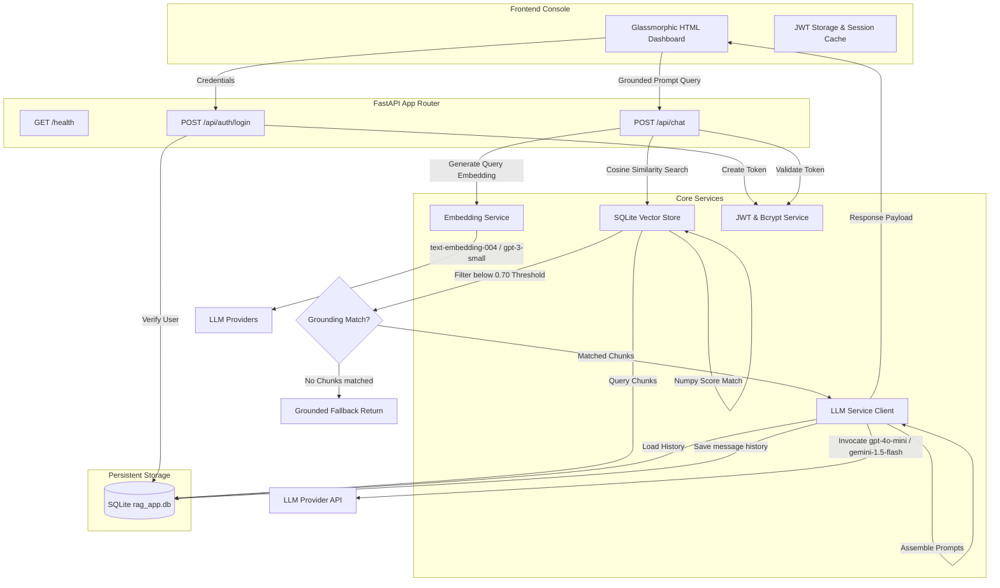

# TrueAILab RAG Chat Assistant – Production-Grade Support Portal

A production-style, premium GenAI-powered Customer Support Portal featuring **Retrieval-Augmented Generation (RAG)**. The application features a FastAPI backend, a custom vector store utilizing SQLite, cosine similarity index matching, multi-turn conversation memory, JWT-based security authentication, and a visual glassmorphic web dashboard.

---

## 🛠️ Tech Stack & Architecture

### Backend Core
* **FastAPI:** High-performance, asynchronous REST framework with Pydantic JSON schema validations.
* **SQLite:** Fully persistent, lightweight relational storage representing a production-grade custom Vector Database.
* **NumPy:** Pure mathematical vector processing for lightning-fast Cosine Similarity checks.
* **PyJWT & Bcrypt:** Secure cryptographic hashing and JWT session authorization.
* **HTTPX:** Resilient HTTP interface for LLM completions and embeddings.

### Frontend Dashboard
* **Vanilla HTML5 & CSS3:** Sleek responsive panels using high-density grid layouts.
* **Glassmorphic Glass Styling:** 16px blur filters, border overlays, custom interactive scrollbars, and neon color palettes.
* **Marked.js:** Modern client-side Markdown parser for rich markdown support in chat outputs.

---

## 📋 Architectural Workflow



---

## 💡 RAG & Grounding Strategies

### 1. Document Chunking Strategy
Long documents are split into concepts using an **overlapping word-count splitter** (`app/utils/chunker.py`):
* **Segment Size:** ~200 words.
* **Boundary Overlap:** 40 words.
This overlap guarantees that context boundaries remain unbroken across chunks.

### 2. Embedding Strategy
Text is converted into high-density dense vectors (768-dimensional or 1536-dimensional) using:
* **Gemini Embeddings:** `text-embedding-004` (Default, recommended) OR
* **OpenAI Embeddings:** `text-embedding-3-small`

### 3. Similarity Search & Grounding Threshold
Rather than using basic keyword matching, we calculate the mathematical **Cosine Similarity** between the query vector and chunk vectors:

$$\text{Cosine Similarity}(A, B) = \frac{A \cdot B}{\|A\| \|B\|}$$

* **Similarity Threshold (Default: 0.70):** If the highest similarity score is less than this value, the server **skips LLM invocation completely**, saving token cost and preventing hallucinations. It immediately returns:
  > *"I could not find enough information in the knowledge base to answer this question."*
* **Top K Chunks (K = 3):** If valid matches exist, the top 3 scoring context blocks are fed into the prompt.

### 4. Grounded Prompt Design
System prompt templates strictly restrict the LLM from fabricating details:
```
You are a helpful and professional customer support GenAI assistant at TrueAILab.
Use ONLY the provided retrieved context chunks to answer.
If the answer cannot be directly derived from context, state that you do not have enough information.
```

---

## 💾 SQLite Relational Schema
SQLite handles full persistence of vector data and conversation history:
* `users`: Stores registration metadata and credentials.
* `documents`: Persistent store for indexed knowledge files.
* `chunks`: Stores chunk text extracts linked to embeddings (serialized as JSON list strings).
* `chat_sessions`: Persistent session tracker associated with user IDs.
* `chat_messages`: Multi-turn persistent memory history.

---

## 🚀 Setup & Execution Guide

### Prerequisites
* **Python 3.9+** (Supports system Python natively)

### 1. Installation
Clone or enter the project directory and create a Python virtual environment:
```bash
# Create virtualenv
python3 -m venv venv
source venv/bin/activate

# Install requirements
pip install -r requirements.txt
```

### 2. Configure Environment `.env`
Ensure you copy the `.env.example` file and set your API keys:
```bash
cp .env.example .env
```
Open `.env` and configure:
```env
LLM_PROVIDER=gemini # or openai
EMBEDDING_PROVIDER=gemini # or openai
GEMINI_API_KEY=AIzaSy... # Your Gemini Key
```

### 3. Run FastAPI Application
To start the production server:
```bash
python3 -m uvicorn app.main:app --reload --port 8000
```
On system startup:
1. SQLite schemas are loaded automatically.
2. The `docs.json` knowledge base is loaded, chunked, embedded, and indexed.
3. The server starts hosting the static dashboard on **`http://127.0.0.1:8000`**.

---

## 🔍 Validation & Testing
We have included a comprehensive programmatic validation script (`scratch/test_api.py`) to verify health check, user registration, JWT token generation, RAG query retrieval, and strict grounding fallbacks.

Run the test suite using:
```bash
python3 scratch/test_api.py
```
# TRUEAILAB_project
